# SwitchBot Controller

**🌐 [English](./README.md) | 日本語**

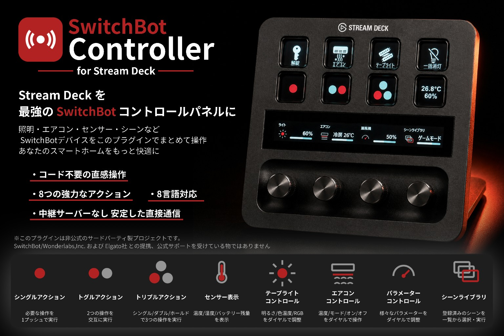

<p align="center">
  <a href="./docs/video/demo.mp4">
    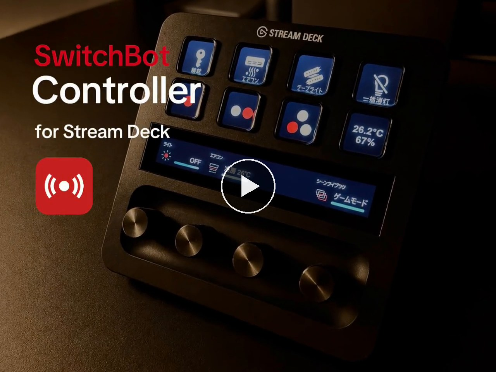
  </a>
  <br>
  <sub>▶ 画像をクリック→「View raw」から25秒のデモ動画をダウンロード・再生できます</sub>
</p>

## SwitchBotをStream Deckから、もっと直感的に。

APIコードを書く必要はありません。**デバイスを選んで、操作を選択するだけ。**

ON/OFF・トグル・センサー表示・テープライト・エアコン・シーン実行・ダイヤル操作まで、様々なアクションに対応。普段スマートフォンで行っているSwitchBotの操作を、そのままStream Deckから直接実行できます。

> [!WARNING]
> 本プロジェクトは**非公式のサードパーティ製プロジェクト**です。SwitchBot / Wonderlabs, Inc. との提携、承認、公式サポートを受けているものではありません。

[](./LICENSE)
[](https://docs.elgato.com/streamdeck/sdk/)
[](https://github.com/OpenWonderLabs/SwitchBotAPI)

---

**[⬇ 最新版をダウンロード](../../releases/latest)** · **[インストール手順](#一般ユーザー向け--推奨)**

**[不具合を報告](../../issues)** · **[機能をリクエスト](../../issues)**

※ リンク先のIssue一覧ページ右上にある「New issue」から投稿できます（日本語のフォームもご用意しています）。

---

## 目次

- [SwitchBot Controllerとは？](#switchbot-controllerとは)
- [機能一覧](#機能一覧)
- [実機での動作](#実機での動作)
- [対応環境](#対応環境)
- [3分で始めるSwitchBot Controller](#3分で始めるswitchbot-controller)
- [インストール](#インストール)
- [SwitchBot APIの認証情報](#switchbot-apiの認証情報)
- [設定画面](#設定画面)
- [アクション](#アクション)
- [対応デバイス・コマンド](#対応デバイスコマンド)
- [多言語対応](#多言語対応)
- [プライバシーとセキュリティ](#プライバシーとセキュリティ)
- [⚠️ 制限事項](#️-制限事項)
- [トラブルシューティング](#トラブルシューティング)
- [プロジェクトの状態](#プロジェクトの状態)
- [プロジェクトを応援する](#プロジェクトを応援する)
- [開発者向け情報](#開発者向け情報)
- [コントリビューション](#コントリビューション)
- [ライセンス](#ライセンス)

---

## SwitchBot Controllerとは？

SwitchBotはスマートフォンから簡単に操作できます。しかし、PCで作業しているときに、わざわざスマートフォンを取り出して操作するのは少し面倒です。

**SwitchBot Controllerは、あなたの手元にあるStream DeckからSwitchBotを操作できるようにします。**

### コードを書かなくても、SwitchBot APIを使いこなせる

SwitchBotには公式のAPIが公開されていますが、自分のツールから直接叩こうとすると、意外とやることが多いです。

| ❌ 従来のAPI連携 | ✅ SwitchBot Controller |
|:---|:---|
| ① SwitchBot APIのドキュメントを読む | ① デバイスを選ぶ |
| ② HMAC-SHA256の認証コードを書く | ② 操作を選ぶ |
| ③ コマンドのパラメータ形式を調べる | ③ 実行 |
| ④ Device IDを調べて入力する | |
| ⑤ 実行してエラーと格闘する | |
| **→ 時間がかかる** | **→ 数十秒** |

SwitchBot Controllerは、この面倒な工程をあらかじめ全て済ませてあります。あなたがすることは、**設定画面のプルダウンからデバイスと操作を選ぶだけ**です。

-  **シングルアクション** — 必要な操作をすぐに実行
-  **トグルアクション** — ON ↔ OFFなど
-  **トリプルアクション** — 1キーに最大3種類の操作を割り当て
-  **センサー表示** — 温度、湿度、バッテリー残量を表示
-  **テープライトコントロール** — 明るさ、色温度、RGBカラー、シーンを調整
-  **エアコンコントロール** — 温度、モード、電源を調整
-  **パラメーターダイヤル** — 任意のデバイス、数値を調整
-  **シーンライブラリ** — SwitchBotのシーンを一覧から実行
- **8言語対応** — 日本語、英語、ドイツ語、フランス語、スペイン語、韓国語、中国語（簡体字）、中国語（繁体字）

---

---

## 機能一覧

| アクション | Stream Deck | Stream Deck + | 機能 |
|---|:---:|:---:|---|
| **シングルアクション** | ○ | ○ | 1つのデバイス操作またはシーンを実行 |
| **トグルアクション** | ○ | ○ | 2つの操作を交互に実行 |
| **トリプルアクション** | ○ | ○ | シングル / ダブル / 長押しにそれぞれ操作を割り当て |
| **センサー表示** | ○ | ○ | 温度、湿度、バッテリーを表示 |
| **テープライトコントロール** | — | ○ | ダイヤルでテープライトを操作 |
| **エアコンコントロール** | — | ○ | 温度 / モード / 電源を操作 |
| **パラメーターコントロール** | — | ○ | 汎用的な数値パラメーターをダイヤル操作 |
| **シーンライブラリ** | — | ○ | シーンを一覧から選択・実行 |

---

---

## 実機での動作

実際のStream Deck +でSwitchBot Controllerを使用している様子です。

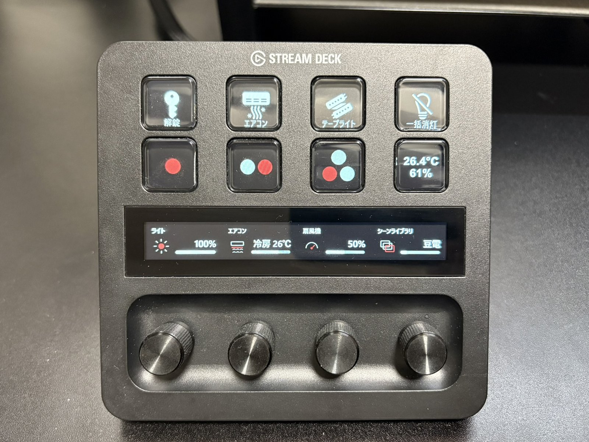

*Stream Deck +上で、鍵・エアコン・テープライト・一括消灯・シーンライブラリなどをまとめて操作している例です。ダイヤル上部のタッチディスプレイには、ライト・エアコン・扇風機・シーンライブラリの現在の状態がリアルタイムで表示されています。*

### 各ダイヤルアクションの実機操作

| テープライトコントロール | エアコンコントロール | シーンライブラリ |
|:---:|:---:|:---:|
| 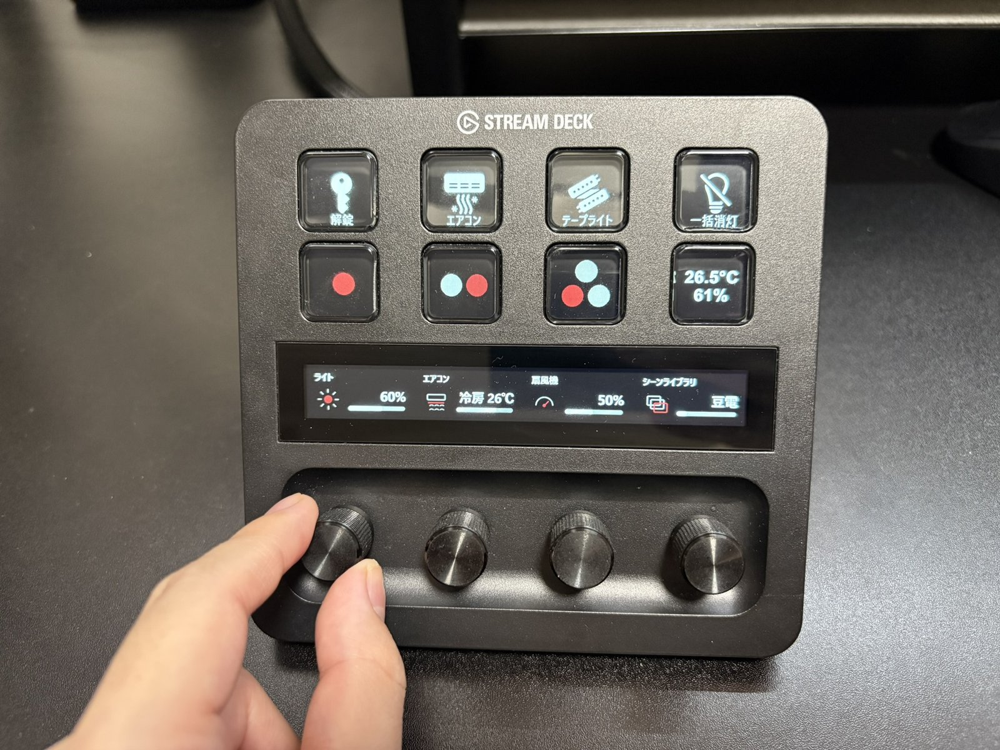 | 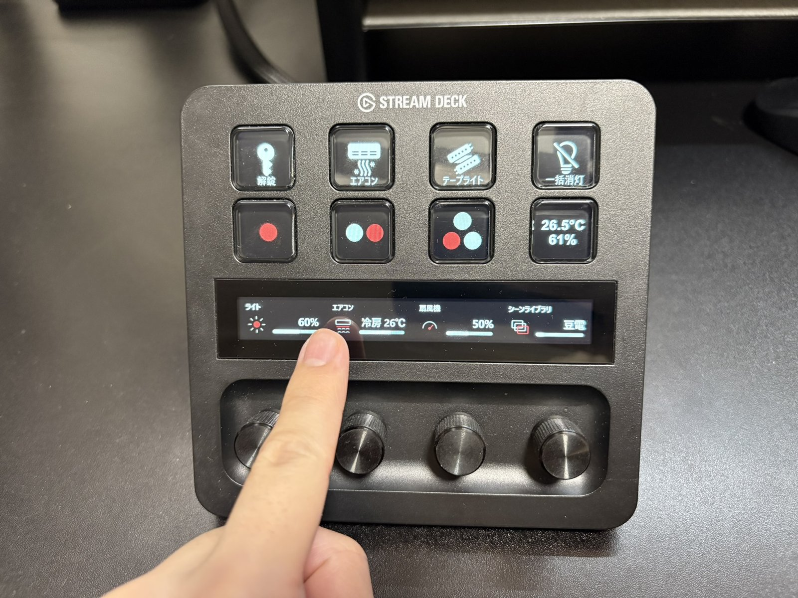 | 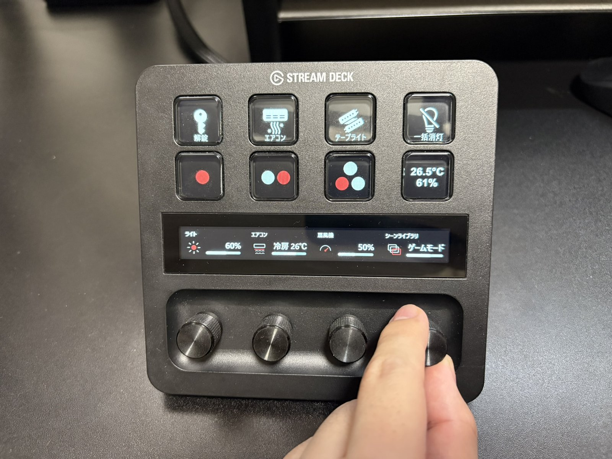 |
| 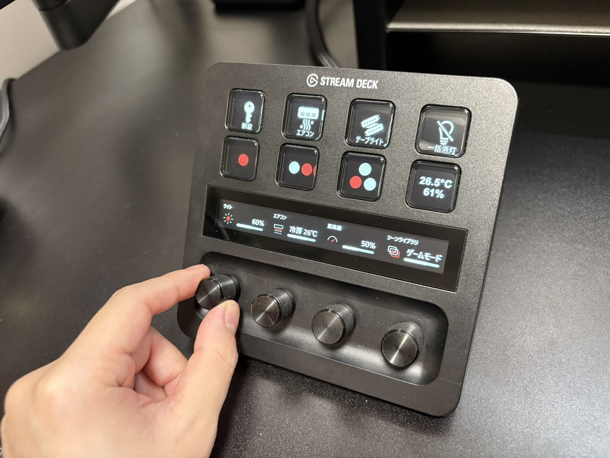 | 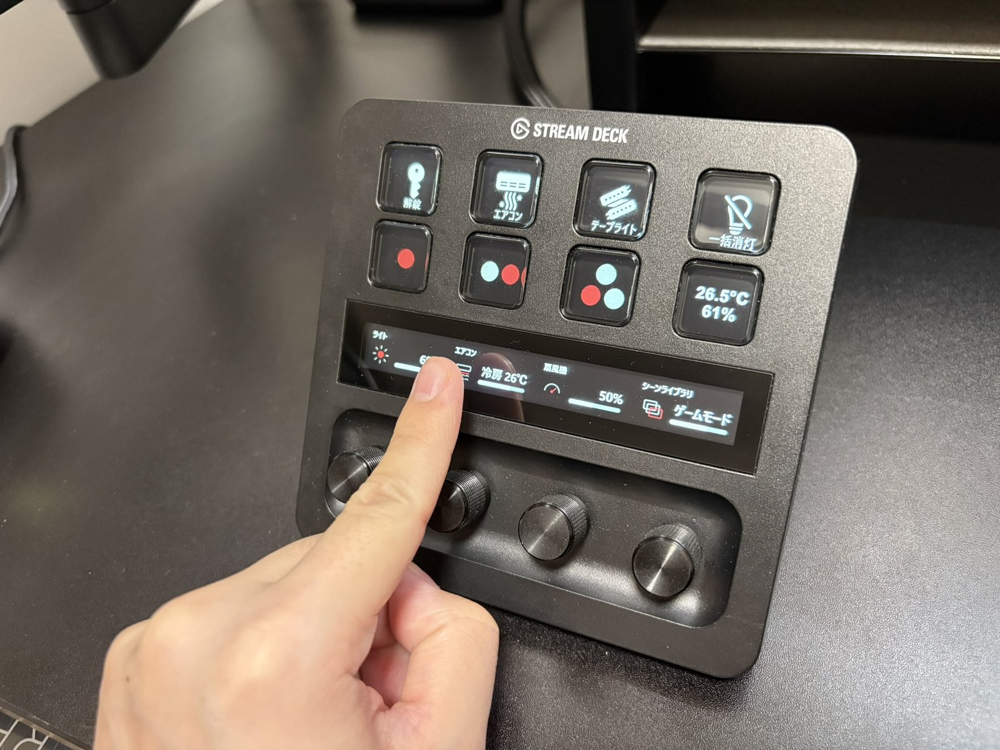 | 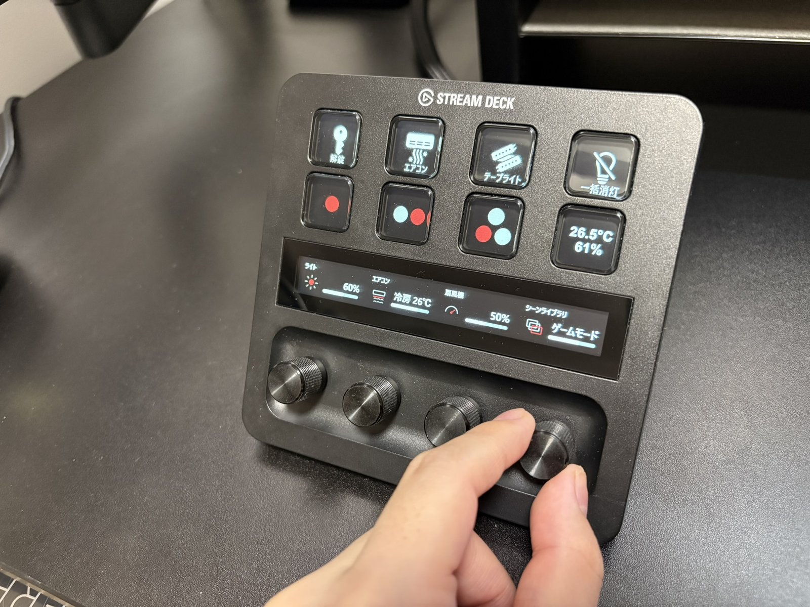 |

### Stream Deck上のアクション配置例

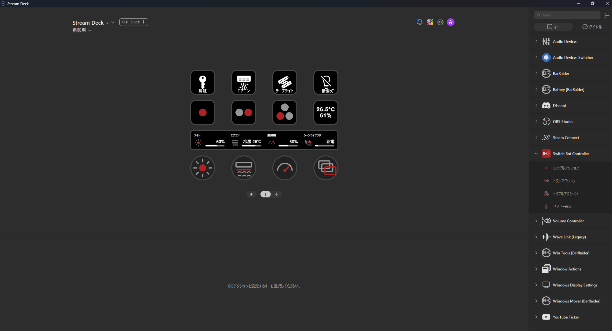

---

## 対応環境

### Stream Deck

**必要なもの:**

- Elgato Stream Deck本体
- Stream Deckソフトウェア **6.5以降**

標準のキーアクションで利用できます:

- シングルアクション
- トグルアクション
- トリプルアクション
- センサー表示

### Stream Deck +

以下のダイヤルアクションには、追加で**Stream Deck +**が必要です:

- テープライトコントロール
- エアコンコントロール
- パラメーターコントロール
- シーンライブラリ

### SwitchBot

本プラグインは公式のSwitchBot APIを使用し、検出したデバイス種別に応じて使用可能なコマンドを自動的に絞り込みます。詳細は[対応デバイス・コマンド](#対応デバイスコマンド)を参照してください。

---

## 3分で始めるSwitchBot Controller

詳しい手順は後述しますが、まずは全体の流れをつかんでください。**たったこれだけです。**

| STEP | 内容 |
|:---:|:---|
| **1** | Stream Deckにプラグインをインストール |
| **2** | SwitchBotアプリでAPIトークン / クライアントシークレットを取得 |
| **3** | Stream Deckのキー / ダイヤルにアクションを配置 |
| **4** | 設定画面にトークン情報を入力 |
| **5** | デバイスまたはシーンを選択 |

これで完了です。コードを書く必要も、APIドキュメントを読み込む必要もありません。以下、それぞれのステップを詳しく説明します。

## インストール

### 一般ユーザー向け — 推奨

最も簡単な方法は、GitHub Releasesから最新の**`.streamDeckPlugin`ファイル**をダウンロードしてインストールする方法です。

> [!TIP]
> リポジトリ公開後、GitHub Releasesのリンクをここに追記します。`v*.*.*`形式のGitタグをプッシュすると、GitHub Actionsによって`.streamDeckPlugin`パッケージが自動生成され、GitHub Releaseへ添付される構成が既に用意されています（`.github/workflows/build.yml`）。

手順：

1. 最新版の`.streamDeckPlugin`をダウンロードします。
2. ダウンロードしたファイルをダブルクリックします。
3. Stream Deckへのインストールを許可します。
4. Stream Deckを起動します。
5. アクション一覧から**SwitchBot Controller**を探します。
6. キーまたはダイヤルへアクションをドラッグ＆ドロップします。
7. **トークン**と**クライアントシークレット**（[取得方法](#取得方法)）を入力し、使いたいアクションを設定してください。

| ダウンロードしたファイル | Stream Deckへのインストール確認 |
|:---:|:---:|
| 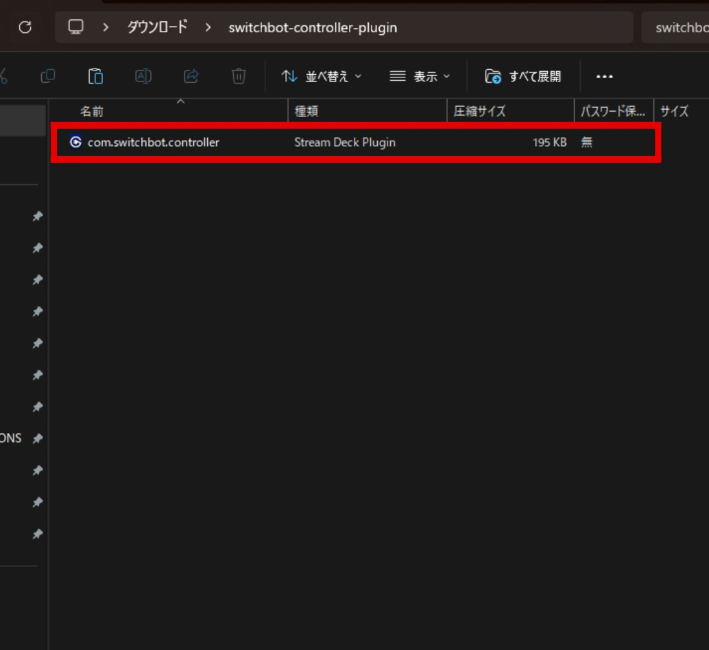 | 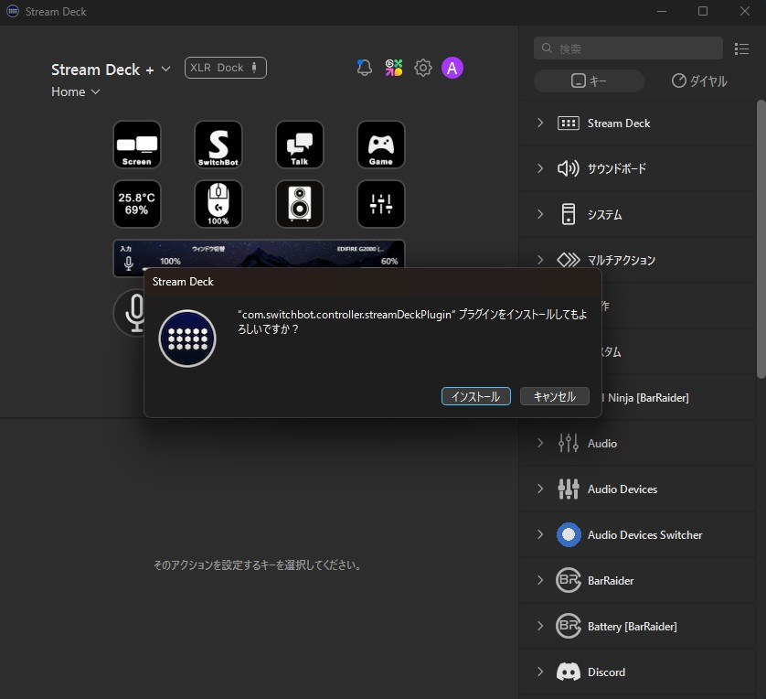 |

ソースコードからビルドしたい場合は、「[開発者向け情報](#開発者向け情報)」を参照してください。

---

## SwitchBot APIの認証情報

このプラグインはSwitchBot APIと直接通信します。
必要な情報：

- **トークン**
- **クライアントシークレット**

### 取得方法

1. SwitchBotアプリを開きます。
2. **プロフィール**を開きます。
3. **設定**を開きます。
4. **基本データ**を開きます。
5. **アプリバージョン**の表示部分を連続タップします（開発者権限が有効になります）。
6. 表示された**開発者向けオプション**を開きます。
7. **トークン**と**クライアントシークレット**をそれぞれコピーします。

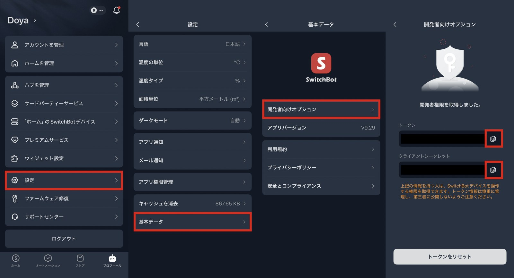

*実際の画面はこのようになります（画像内のトークン / クライアントシークレットは黒塗りしています）。*

トークン / クライアントシークレットは全アクションで共有され、いずれか1つのアクションの設定画面で入力すれば、他のアクションにも自動的に反映されます（グローバル設定として1箇所で管理）。

認証方式（HMAC-SHA256署名）や仕様の詳細は、[SwitchBot公式APIドキュメント](https://github.com/OpenWonderLabs/SwitchBotAPI)を参照してください。

> [!IMPORTANT]
> **トークンやクライアントシークレットをGitHub Issue、スクリーンショット、ソースコード、READMEなどの公開場所に絶対に掲載しないでください。**

---

---

## 設定画面

実際の画面はこのようになります。

### シングルアクションの設定画面

| 基本設定 | デバイス選択 | コマンド選択 |
|:---:|:---:|:---:|
| 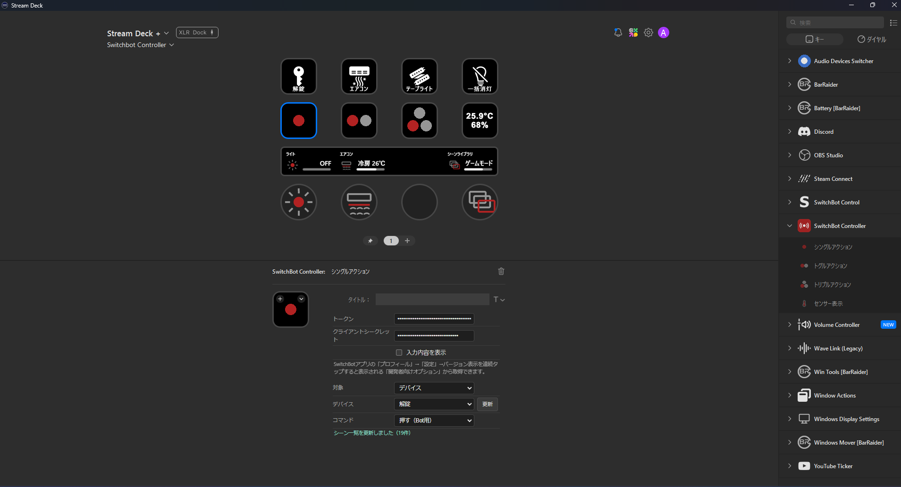 | 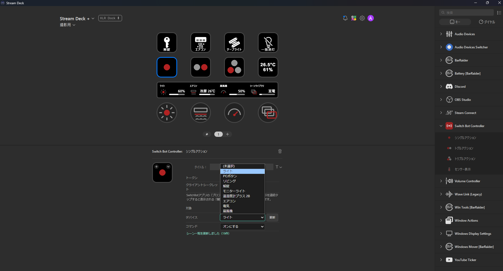 | 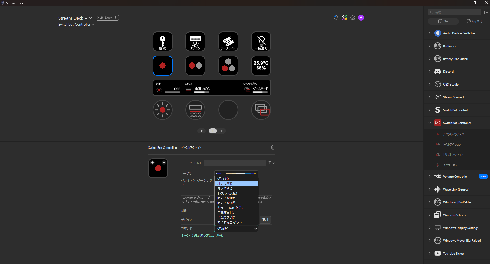 |

| 対象切替（デバイス/シーン） | シーン選択 |
|:---:|:---:|
| 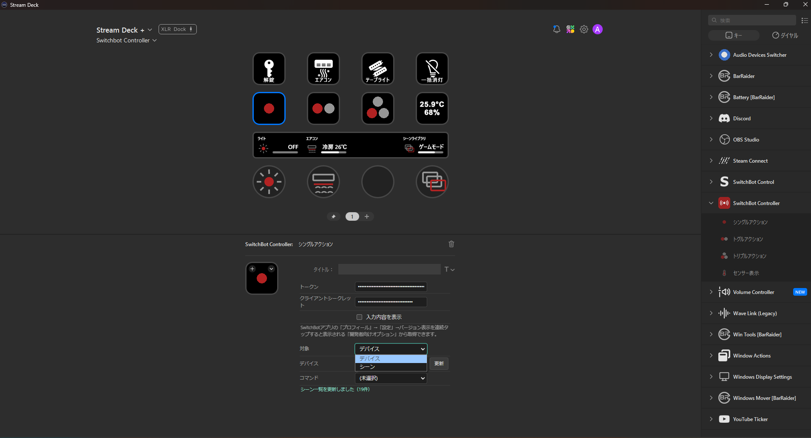 | 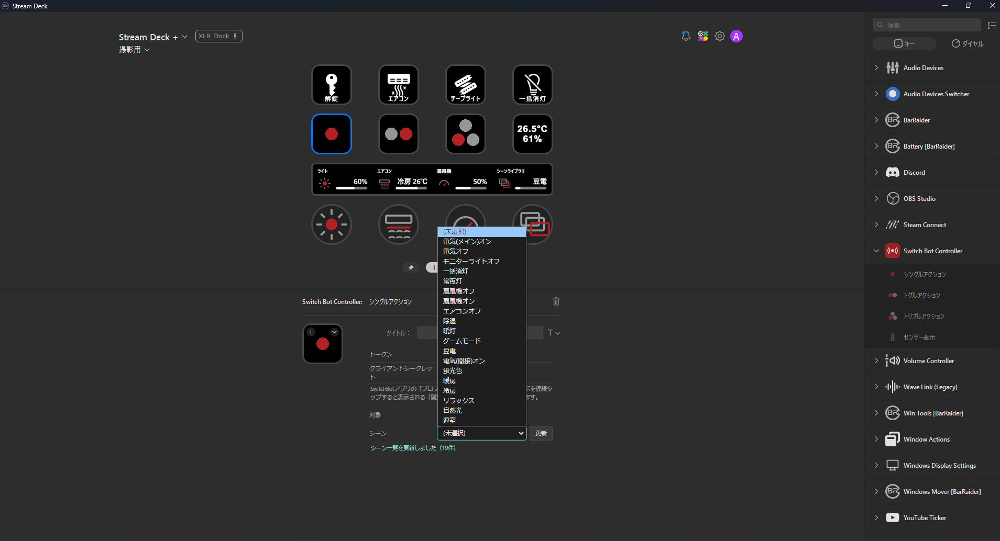 |

トークン / クライアントシークレットが写っている箇所は、公開にあたって黒塗りしています。

### トグルアクションの設定画面

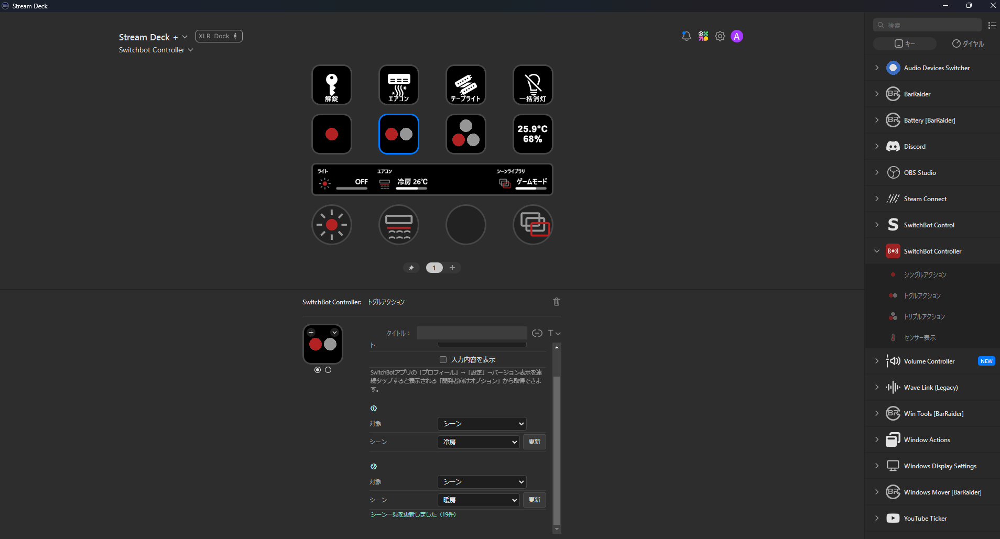

2つの操作それぞれに、対象（デバイス/シーン）を設定します。

### トリプルアクションの設定画面

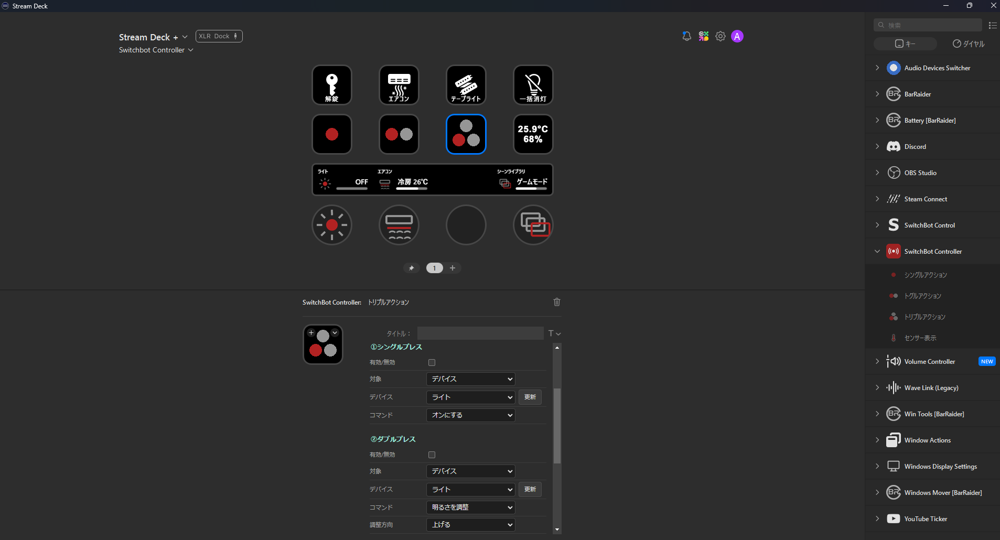

シングルプレス・ダブルプレス・長押しそれぞれに、有効/無効と対象・コマンドを個別に設定します。

### センサー表示の設定画面

| 設定画面 | 実機表示 |
|:---:|:---:|
| 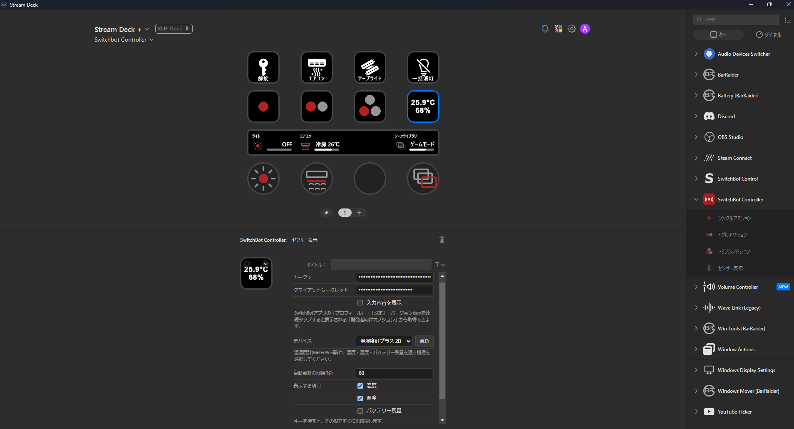 | 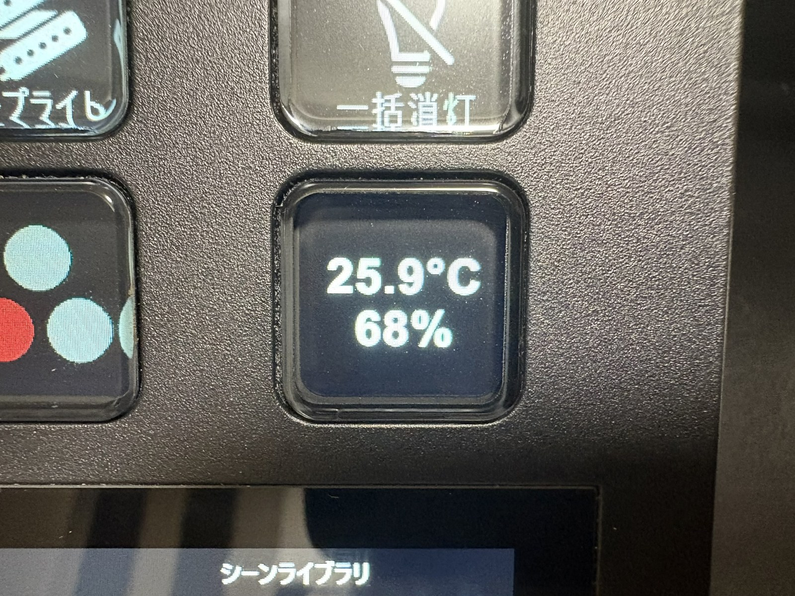 |

表示する項目（温度/湿度/バッテリー残量）、自動更新の間隔を設定できます。

### テープライトコントロール設定

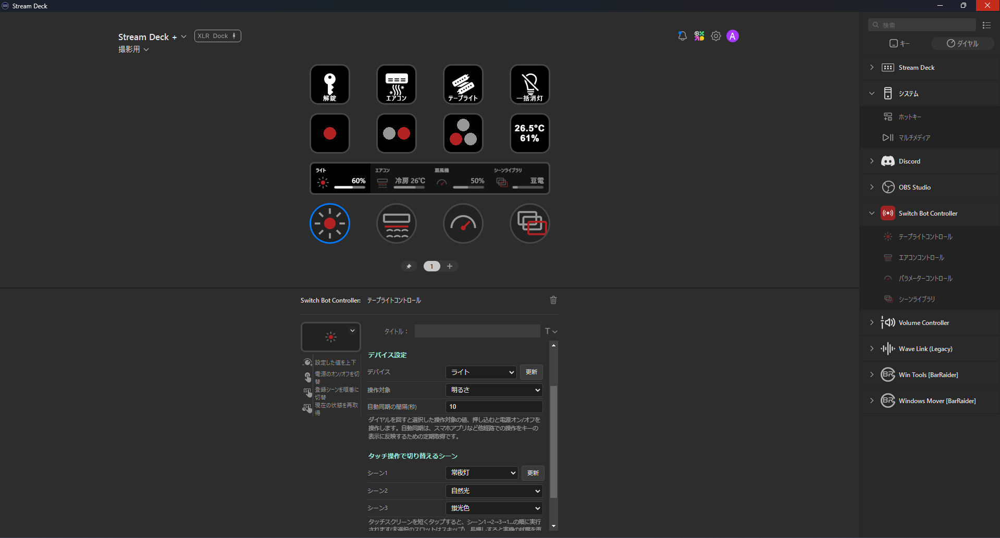

デバイス、パラメーター（明るさ / 色温度 / カラー(RGB) / カスタム。選択したデバイスが対応するものだけが選択肢に表示されます）、自動同期間隔、タッチ操作で切り替えるシーンなどを設定できます。

### エアコンコントロール設定

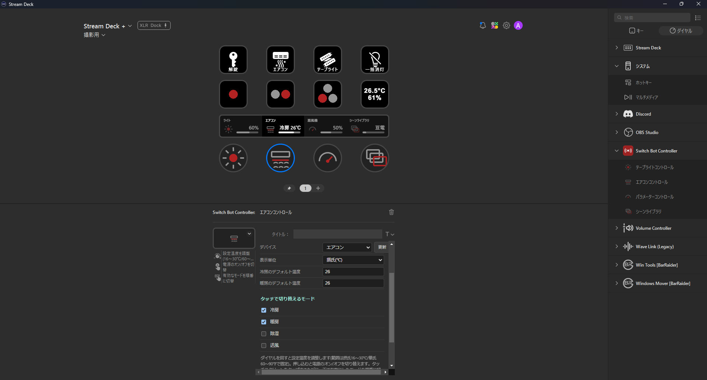

表示単位（℃/℉）、冷房・暖房それぞれのデフォルト温度、タッチで切り替えるモード（冷房/暖房/除湿/送風）を個別に設定できます。

### シーンライブラリ設定

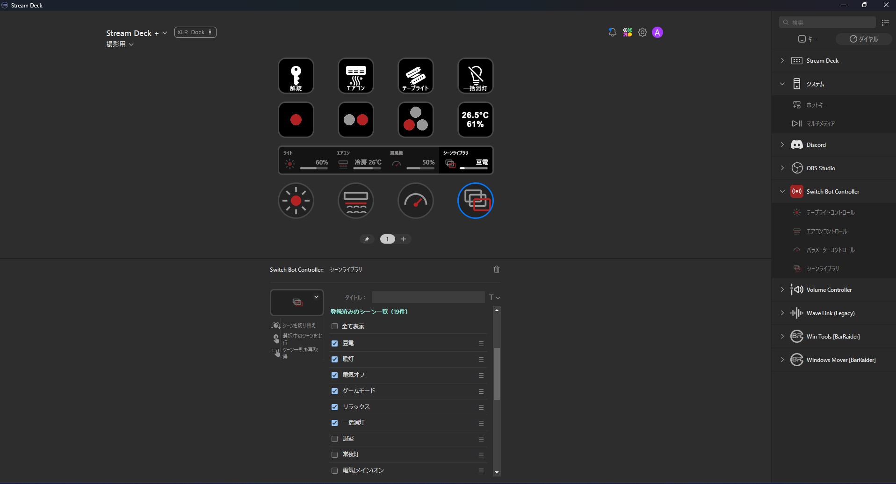

登録済みのシーンから、Stream Deck +に表示するシーンを個別に選択できます。ドラッグ＆ドロップによる並び替え、「全て表示」による一括切替にも対応しています。

> [!NOTE]
> 実機写真・設定画面は実際にビルドしたプラグインを使用して撮影したものです。パラメーターコントロールの設定画面のみ、対応するデバイスを所有していないため掲載していません。

---

---

# アクション

##  シングルアクション

1つのStream Deckキーに、1つのSwitchBot操作を割り当てます。

対応コマンドには以下が含まれます（対応表は[後述](#対応デバイスコマンド)）。

- オン / オフ / トグル / 押す
- 施錠 / 解錠
- カーテン位置を指定
- 明るさを指定 / 明るさを調整
- カラー(RGB)を指定
- 色温度を指定 / 色温度を調整
- エアコン詳細設定 / エアコン温度調整
- カスタムコマンド
- シーン実行

Stream Deck標準の**Multi Action**にも対応しており、他のStream Deckアクションと組み合わせて使用できます。

**おすすめ：** 照明、プラグ、カーテン、ロック、シーンなど、日常的に使う操作。

---

##  トグルアクション

1つのキーに2つの操作を割り当て、交互に実行します（① → ② → ① → ② → …）。

```text
1回目  → 照明 ON
2回目  → 照明 OFF
3回目  → 照明 ON
```

状態はStream Deckのネイティブ2ステート機構で管理されるため、Stream Deckを再起動した後も状態を保持できます。状態①と状態②には、Stream Deck標準の画像設定機能を使って異なるキー画像を設定できます。

**おすすめ：** ON/OFF操作や2状態のワークフロー。

---

##  トリプルアクション

1つのキーに最大3種類の操作を割り当てられます。

| 操作 | 例 |
|---|---|
| シングルクリック | 照明ON |
| ダブルクリック | シーン実行 |
| 長押し | 照明OFF |

**おすすめ：** 1つの物理キーからより多くの操作を実行したい場合。

> [!NOTE]
> シングルクリックとダブルクリックを判定するため、シングルクリックの実行には約300msの遅延があります（`DOUBLE_PRESS_WINDOW_MS`で調整可能）。ホールド判定の閾値は0.5秒です。

---

##  センサー表示

SwitchBotセンサーの情報をStream Deckキー上に表示します。

表示できる値：

- 温度
- 湿度
- バッテリー残量

設定した間隔で自動更新できるほか、キーを押すことで即時更新することもできます。

**おすすめ：** デスク周辺の温度・湿度などを常時確認したい場合。

---

# Stream Deck +専用アクション

##  テープライトコントロール

SwitchBotテープライト / 対応するテープライトをStream Deck +のダイヤルから操作します。

### ダイヤル

- 回転 → 選択中のパラメーターを調整（既定5刻み。**明るさのみ**、1%の状態から反時計回りに回すと表示だけ0%になり、実機へは送信しません）
- 押す → 電源ON/OFF（消灯前の値を記憶し、次回オン時に復元）
- タッチ → 最大3つの登録シーンを順番に切り替え
- 長押し → 実機の状態を再取得

### 対応するパラメーター

- 明るさ
- 色温度
- カラー(RGB) — RGB値を15刻みで変化させ、赤→黄→緑→水色→青→マゼンタ→赤と虹色に一周します（全102ステップ）
- カスタムコマンド

---

##  エアコンコントロール

SwitchBotの赤外線エアコンリモコンをStream Deck +のダイヤルから操作します。

### ダイヤル

- 回転 → 設定温度を調整（範囲は摂氏16〜30℃または華氏60〜90℉で固定。表示単位は設定画面で選択）
- 押す → 電源ON/OFF
- タッチ → 有効にした運転モードを順番に切り替え（冷房/暖房への切替時は、それぞれ設定したデフォルト温度を適用）

対応モード：冷房 / 暖房 / 除湿 / 送風（設定画面のチェックボックスでタッチの対象を選択。既定は冷房・暖房のみ有効）

### 他アクションとの連動

シングル/トグル/トリプルアクション・パラメーターコントロールのタッチ操作にある「エアコン詳細設定」「エアコン温度調整」コマンドとは、**共有状態**（デバイスIDごとにグローバル設定へ保存）を介して温度・モード・電源が相互に反映されます。エアコンコントロールは約5秒ごとにこの共有状態を確認し、他のキーからの変更を画面に反映します（自分の操作直後4秒間は自動反映を止め、操作した値を優先します）。

### 重要な制限

SwitchBotの赤外線リモコンは、Hub経由で信号を送信するだけの一方向の仕組みです。そのため、スマホアプリや物理リモコンからエアコンを操作しても、実際のエアコンの状態をAPI経由で取得することはできません。画面に表示される状態は、**このプラグイン（または連動する他のキー）が最後に送信した内容**であり、実際のエアコン本体の状態を保証するものではありません。

---

##  パラメーターコントロール

SwitchBotの数値パラメーターを汎用的に操作できるダイヤルです。

設定項目：デバイス、パラメーター、最小値、最大値、刻み幅、単位。プリセットを選ぶと自動入力されます（手動調整も可能）。

用意されているプリセット：

- 明るさ
- カーテン位置
- 色温度
- カスタム

タッチディスプレイには最大3つの操作（デバイス操作 or シーン実行）を割り当てられ、シングル/トグル/トリプルアクションと同じ画面で設定します。エアコン詳細設定/温度調整、明るさ/色温度の調整コマンドもタッチ側で選択可能です。

**おすすめ：** 特定のデバイス専用ではなく、柔軟なダイヤル操作をしたい場合。

---

##  シーンライブラリ

登録済みのSwitchBotシーンを、Stream Deck +のダイヤルから一覧表示・実行できます。

### ダイヤル

- 回転 → シーンを切り替え
- 押す → 選択中のシーンを実行
- タッチ → シーン一覧を再取得

### シーン管理（設定画面）

- 個別シーンの表示 / 非表示、「全て表示」による一括切替
- ドラッグ＆ドロップによる並び替え
- シーン名の文字サイズ調整
- 自動更新の有効/無効・間隔設定（既定は手動更新。API呼び出し回数を抑えるため）

---

# 対応デバイス・コマンド

対応しているデバイスタイプに応じて、使用可能なコマンドを自動的に絞り込みます。

| デバイス | 対応コマンド |
|---|---|
| ボット | ON / OFF / Toggle / Press |
| カーテン各種 / ブラインドポール / ロールスクリーン | ON / OFF / カーテン位置を指定 |
| プラグ各種 | ON / OFF / Toggle |
| スマート電球 / テープライト各種 | ON / OFF / Toggle / 明るさ(指定・調整) / カラー(RGB) / 色温度(指定・調整) |
| シーリングライト各種 | ON / OFF / Toggle / 明るさ(指定・調整) / 色温度(指定・調整) |
| エアコン（赤外線） | ON / OFF / Toggle / エアコン詳細設定 / エアコン温度調整 |
| ドアロック各種 | Lock / Unlock |
| スマート加湿器 / 気化式加湿器 | ON / OFF / Toggle |

**Custom Command**は、絞り込みが行われる場合でも常に選択肢に残ります。上表に無いデバイス種別（対応表に登録のない赤外線リモコンやセンサー類など）は絞り込みを行わず、全コマンドを表示します。

> デバイスの対応状況拡充は継続課題です。新しいデバイスやコマンドでも、多くの場合Custom Commandで代替できます。

---

---

# 多言語対応

現在、以下の8言語に対応しています。

日本語 / 英語 / ドイツ語 / フランス語 / スペイン語 / 韓国語 / 中国語（簡体字） / 中国語（繁体字）

Stream Deckのアクション情報と設定画面のUIの両方が多言語化されています（`tests/pi-common.test.ts`で全言語・全キーの整合性を自動検証）。

> [!NOTE]
> 日本語と英語以外の翻訳については、現在ネイティブスピーカーによる完全なレビューを行っていません。翻訳の改善提案や修正への貢献を歓迎します。

---

---

# プライバシーとセキュリティ

このプラグインは、通常のAPI通信において**PCとSwitchBot APIの間で直接通信**する設計です。開発者が所有する中継サーバーは使用していません。

### 認証情報

トークンとクライアントシークレットはStream Deckの設定に保存されますが、**本プラグインによって暗号化されるものではありません。** 共有PCなどで使用する場合はご注意ください。

### ログ

ログにはデバイス名・シーン名など、使用しているSwitchBot環境に関する情報が含まれる可能性があります。トークンとクライアントシークレットを意図的にログへ出力することはありません。ログをGitHub Issueなどへ投稿する場合は、個人情報や環境情報が含まれていないか確認してください。

### ネットワーク

通常のAPIリクエストは`https://api.switch-bot.com`へ直接送信されます。

---

---

# ⚠️ 制限事項

### SwitchBot APIのレート制限

SwitchBot APIには利用回数の制限（1トークンあたり1日10,000回）があります。本プラグインでは以下の対策を実装しています。

- 同一デバイスへの短時間の状態キャッシュ・重複リクエスト抑制（`src/device-status-cache.ts`）
- レート制限（HTTP 429 / 日次上限到達）の検出（`src/switchbot-api.ts`の`isRateLimitError`）
- 対応するダイヤル / センサーアクションでの専用レート制限エラー表示（「通信エラー」と区別して「レート制限」と表示）

不要に短い間隔でのポーリングは避けてください。

### Toggle

Toggleコマンドは`GET /devices/{id}/status`で電源状態を取得してから反転させる方式のため、`power`フィールドを返すデバイスのみ正しく動作します。エアコンなどの赤外線リモコンでは状態を取得できないため、確実な切り替えが必要な場合は明示的なON/OFFコマンドの使用をおすすめします。

### エアコンの状態

SwitchBot APIから赤外線エアコンの実際の物理状態を取得することはできません（[エアコンコントロールの説明](#重要な制限)を参照）。

### シーン実行後の状態同期

SwitchBotシーンの実行時、シーンに含まれる各デバイス操作の内容をAPI経由で取得することはできません。そのため、シーン実行によってエアコンや照明の状態が変化しても、プラグイン側の表示（エアコンコントロールの共有状態など）は自動的には同期されません。

### ダイヤル操作中に値が戻ってしまう場合

自動同期（定期ポーリング）や設定画面の変更イベントが、ダイヤル操作直後の値を古い情報で上書きしてしまうことを防ぐため、操作直後の数秒間は自動反映を止める「クワイエット期間」の仕組みを実装しています。

---

---

# トラブルシューティング

## プラグインがStream Deckに表示されない

1. Stream Deckを再起動します。
2. プラグインのディレクトリ名が正確に`com.switchbot.controller.sdPlugin`になっているか確認します。
3. 開発環境の場合、`npx @elgato/cli link com.switchbot.controller.sdPlugin`を実行します。
4. Stream Deckソフトウェアが必要なバージョン（6.5以降）以上であることを確認します。

## デバイス一覧が空

トークン / クライアントシークレット / SwitchBotアカウント / インターネット接続 / SwitchBot APIの稼働状況を確認し、設定画面を再度開くか、該当する更新ボタンを押してください。

## コマンドが表示されない

プラグインは検出したデバイスタイプに応じてコマンドをフィルタリングします。デバイスが内蔵の対応表（[対応デバイス・コマンド](#対応デバイスコマンド)）に含まれていない場合は、Custom Commandを試してください。

## ダイヤル操作中に値が戻ってしまう

[制限事項](#ダイヤル操作中に値が戻ってしまう場合)を参照してください。改善されない場合は、デバイスモデルとログを添えてIssueを作成してください。

---

---

# プロジェクトの状態

**現在のバージョン：1.0.0**

基本的な製品機能が完成しており、このリポジトリを本プロジェクトの公開拠点として運用することを想定しています。

### 完了

- [x] 8種類のStream Deckアクション
- [x] Stream Deck +のダイヤル対応
- [x] SwitchBot API認証・レート制限検出
- [x] デバイス / シーン取得
- [x] センサー表示
- [x] テープライト操作（明るさ・色温度・カラー(RGB)）
- [x] エアコン操作（他アクションとの状態連動を含む）
- [x] 汎用パラメーターダイヤル
- [x] シーンライブラリ（並べ替え・表示切替対応）
- [x] 多言語UI（8言語）
- [x] ユニットテスト・型チェック
- [x] ESLint / Prettier
- [x] GitHub Actionsによるビルド・型チェック・テスト自動化
- [x] MIT License
- [x] オリジナルアイコンセット

### 今後の予定

- [ ] コミュニティによるデバイス / コマンド対応の拡充
- [ ] すぐに使えるStream Deckプロファイルの追加
- [ ] Elgato Marketplaceへの公開
- [ ] 追加言語のネイティブレビュー
- [ ] パラメーターコントロールの設定画面スクリーンショット追加（対応するデバイス入手後に対応予定）
- [ ] Multi Action対応の拡大（現在はシングルアクションのみ）

---

---

# プロジェクトを応援する

このプラグインが役に立った場合は、ぜひプロジェクトを応援してください。

- **⭐ GitHubでStar** — 他のStream Deck / SwitchBotユーザーに見つけてもらいやすくなります
- **バグを報告** — 問題が発生した場合はGitHub Issueを作成してください
- **機能をリクエスト** — 対応してほしいSwitchBotデバイスやコマンドがあれば送ってください
- **シェア** — 他のStream Deckユーザーやスマートホームユーザーへの共有も歓迎です

---

# 開発者向け情報

> [!TIP]
> **使うだけ**であれば、このセクションは読み飛ばして問題ありません。`.streamDeckPlugin`パッケージをインストールするだけで利用できます(「[インストール](#インストール)」を参照)。

### ソースコードからインストール

自分でプラグインをビルドする場合：

#### 必要環境

- Windows 10以降 または macOS 10.15以降
- Elgato Stream Deck
- Stream Deckソフトウェア **6.5以降**
- Node.js 20以降
- SwitchBot APIの認証情報

Stream Deck +のダイヤルアクション（テープライトコントロール・エアコンコントロール・パラメーターコントロール・シーンライブラリ）を使用する場合は、Stream Deck +が必要です。

Stream Deck SDKの最新の開発要件については、[Elgato公式ドキュメント](https://docs.elgato.com/streamdeck/sdk/introduction/getting-started/)を参照してください。

```bash
git clone https://github.com/DOYA09/switchbot-controller.git
cd switchbot-controller

npm install
npm run build
```

開発中にプラグインを直接リンクする場合：

```bash
npx @elgato/cli link com.switchbot.controller.sdPlugin
```

必要に応じてStream Deckを再起動してください。

---

### プロジェクト構成

```text
switchbot-controller/
├── .github/workflows/build.yml   # CI: Lint・型チェック・テスト・ビルド・パッケージング
├── src/
│   ├── plugin.ts                 # エントリーポイント（全8アクションを登録）
│   ├── global-settings.ts        # 共有グローバル設定の型定義
│   ├── switchbot-api.ts          # SwitchBot API通信・署名生成・レート制限判定
│   ├── device-status-cache.ts    # 同一デバイスへの状態取得キャッシュ
│   ├── ac-state.ts               # エアコンの状態を複数アクション間で共有
│   ├── operation-config.ts       # デバイス操作/シーン実行の共通設定
│   ├── operation-runner.ts       # 全アクション共通の実行ロジック
│   ├── pi-list-handler.ts        # 設定画面からのデバイス/シーン一覧取得
│   └── actions/                  # 8アクションの実装
├── tests/                        # Vitestユニットテスト
├── com.switchbot.controller.sdPlugin/
│   ├── manifest.json
│   ├── en.json 他7言語分のローカライズファイル
│   ├── ui/                       # 設定画面（9画面）
│   └── imgs/
├── docs/images/                  # README用の画像素材
├── package.json
├── rollup.config.mjs
├── tsconfig.json
└── LICENSE
```

### コマンド

| コマンド | 用途 |
|---|---|
| `npm run build` | プラグインをビルド |
| `npm run watch` | 監視しながらビルド |
| `npm run typecheck` | `tsc --noEmit`で型チェックのみ実行 |
| `npm test` | Vitestでユニットテストを実行 |
| `npm run lint` | ESLintを実行 |
| `npm run format` | Prettierでソースコードを整形 |
| `npm run package` | `streamdeck pack`で`.streamDeckPlugin`を作成 |

### CI

GitHub Actionsでは、`main`ブランチへのpushやPRのたびに以下を自動実行します。

1. 依存関係のインストール
2. ESLint
3. TypeScriptの型チェック
4. ユニットテスト（Vitest）
5. ビルド
6. パッケージ化

`v*.*.*`形式のバージョンタグをプッシュすると、生成された`.streamDeckPlugin`を添付したGitHub Releaseを自動作成します。

変更履歴は[CHANGELOG.md](./CHANGELOG.md)を参照してください。

---

---

# コントリビューション

Issue、機能リクエスト、デバイス互換性に関する報告、Pull Requestを歓迎します。

不具合を報告する際は、以下の情報があると原因を特定しやすくなります。

- Stream Deckのモデル / ソフトウェアのバージョン
- OS
- SwitchBotデバイスのモデル
- 使用しているアクション
- 再現手順
- 個人情報を削除した関連ログ（**トークン・クライアントシークレットは絶対に含めないでください**）

新しいSwitchBotデバイスへの対応を追加する場合は、`pi-common.js`の`DEVICE_COMMAND_MAP`とテストの両方を更新してください。

---

---

# ライセンス

このプロジェクトは**MIT License**で公開されています。詳細は[LICENSE](./LICENSE)を参照してください。

---

# 商標・提携に関する注意

**SwitchBot**および関連する製品名は、それぞれの権利者の商標です。本プロジェクトは独立したサードパーティ製プロジェクトであり、**SwitchBot / Wonderlabs, Inc.との提携、承認、スポンサー関係はありません。** 本プラグインは公開されているSwitchBot APIを使用しています。

---

## 公式ドキュメント

- [SwitchBot API](https://github.com/OpenWonderLabs/SwitchBotAPI)
- [Elgato Stream Deck SDK](https://docs.elgato.com/streamdeck/sdk/)
- [Elgato Stream Deck Plugin Guidelines](https://docs.elgato.com/guidelines/stream-deck/plugins/)
