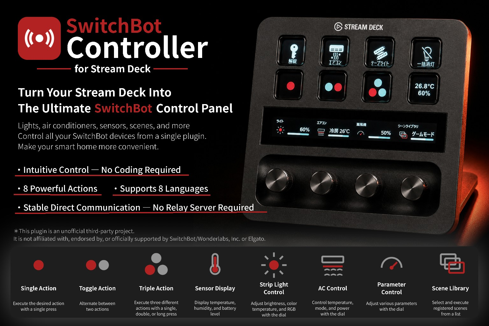
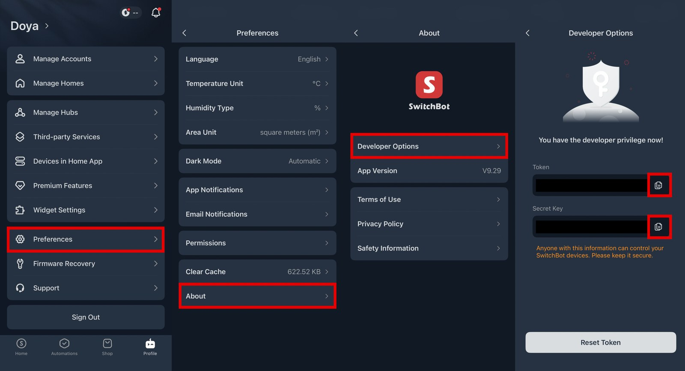

# SwitchBot Controller

**🌐 English | [日本語](./README.ja.md)**



<p align="center">
  <a href="./docs/video/demo.mp4">
    
  </a>
  <br>
  <sub>▶ Click the image, then click "View raw" to download and watch the 25-second demo</sub>
</p>

## Control SwitchBot from your Stream Deck, more intuitively than ever.

No API code required. **Just pick a device, pick an action.**

From ON/OFF and toggles to sensors, strip lights, air conditioners, scenes, and dial control — SwitchBot Controller covers it all. Everything you normally do from the SwitchBot smartphone app, right from your Stream Deck.

> [!WARNING]
> This project is an **unofficial, third-party project**. It is not affiliated with, endorsed by, or officially supported by SwitchBot / Wonderlabs, Inc.

[](./LICENSE)
[](https://docs.elgato.com/streamdeck/sdk/)
[](https://github.com/OpenWonderLabs/SwitchBotAPI)

---

**[⬇ Download Latest Release](../../releases/latest)** · **[Installation Instructions](#for-regular-users--recommended)**

**[Report a Bug](../../issues)** · **[Request a Feature](../../issues)**

※ Click "New issue" in the top right of the Issues page to get started (Japanese-language forms are also available).

---

## Table of Contents

- [What is SwitchBot Controller?](#what-is-switchbot-controller)
- [Features](#features)
- [See It on Real Hardware](#see-it-on-real-hardware)
- [Compatibility](#compatibility)
- [Get Started in 3 Minutes](#get-started-in-3-minutes)
- [Installation](#installation)
- [SwitchBot API Credentials](#switchbot-api-credentials)
- [Property Inspector Screenshots](#property-inspector-screenshots)
- [Actions](#actions)
- [Supported Devices & Commands](#supported-devices--commands)
- [Localization](#localization)
- [Privacy & Security](#privacy--security)
- [⚠️ Limitations](#️-limitations)
- [Troubleshooting](#troubleshooting)
- [Project Status](#project-status)
- [Support the Project](#support-the-project)
- [For Developers](#for-developers)
- [Contributing](#contributing)
- [License](#license)

---

## What is SwitchBot Controller?

SwitchBot is easy to control from your phone. But when you're already at your PC, reaching for your phone just to flip a light switch or start a scene is a small but constant friction.

**SwitchBot Controller puts that control right on the Stream Deck you already have in front of you.**

### Use the SwitchBot API without writing a single line of code

SwitchBot publishes an official API, but wiring it up yourself takes more work than you'd expect.

| ❌ Building it yourself | ✅ SwitchBot Controller |
|:---|:---|
| ① Read through the SwitchBot API docs | ① Pick a device |
| ② Write HMAC-SHA256 authentication code | ② Pick an action |
| ③ Look up each command's parameter format | ③ Run it |
| ④ Find and enter the Device ID | |
| ⑤ Run it, debug it, repeat | |
| **→ Could take hours** | **→ Takes seconds** |

SwitchBot Controller has already done all of that groundwork for you. All you do is **pick a device and an action from a dropdown in the Property Inspector.**

-  **One key, one action** — run what you need instantly
-  **Alternate between two actions** — ON ↔ OFF, and more
-  **Single / double / hold** — up to 3 actions on one key
-  **Sensor readouts** — temperature, humidity, battery level
-  **Strip light control** — brightness, color temperature, RGB color, scenes (Stream Deck +)
-  **Air conditioner control** — temperature, mode, power (Stream Deck +)
-  **Generic parameter dial** — adjust any numeric value without opening the app (Stream Deck +)
-  **Scene library** — browse and run SwitchBot scenes (Stream Deck +)
- **8 languages** — English, Japanese, German, French, Spanish, Korean, Simplified Chinese, Traditional Chinese

---

---

## Features

| Action | Stream Deck | Stream Deck + | What it does |
|---|:---:|:---:|---|
| **Single Action** | ✓ | ✓ | Run one device operation or scene |
| **Toggle Action** | ✓ | ✓ | Alternate between two operations |
| **Triple Action** | ✓ | ✓ | Assign single / double / hold to different operations |
| **Sensor Display** | ✓ | ✓ | Show temperature, humidity, and battery level |
| **Strip Light Control** | — | ✓ | Control a strip light with the dial |
| **Air Conditioner Control** | — | ✓ | Control temperature / mode / power |
| **Parameter Control** | — | ✓ | Adjust any numeric parameter with the dial |
| **Scene Library** | — | ✓ | Browse and run scenes from a list |

---

---

## See It on Real Hardware

SwitchBot Controller running on an actual Stream Deck +.


*Keys for a lock, air conditioner, strip light, all-lights-off, and scene library, alongside dials for each. The touch display at the top of the dials shows the live status of the light, air conditioner, fan, and scene library.*

### Each dial action on real hardware

| Strip Light Control | Air Conditioner Control | Scene Library |
|:---:|:---:|:---:|
|  |  |  |
|  |  |  |

### Example action layout on Stream Deck


---

## Compatibility

### Stream Deck

**Required:**

- An Elgato Stream Deck
- Stream Deck software **6.5 or later**

Works with the standard key actions:

- Single Action
- Toggle Action
- Triple Action
- Sensor Display

### Stream Deck +

A **Stream Deck +** is additionally required for the dial actions:

- Strip Light Control
- Air Conditioner Control
- Parameter Control
- Scene Library

### SwitchBot

The plugin uses the official SwitchBot API and automatically filters available commands according to the detected device type. See [Supported Devices & Commands](#supported-devices--commands).

---

## Get Started in 3 Minutes

Detailed steps follow below, but here's the whole flow at a glance. **That's really all there is to it.**

| STEP | What to do |
|:---:|:---|
| **1** | Install the plugin on your Stream Deck |
| **2** | Get your API Token / Secret Key from the SwitchBot app |
| **3** | Drag an action onto a key or dial |
| **4** | Enter the token info in the Property Inspector |
| **5** | Pick a device or scene |

Done. No code, no API docs to read. Here's each step in detail.

## Installation

### For regular users — recommended

The easiest way is to download the latest **`.streamDeckPlugin`** file from GitHub Releases and install it.

> [!TIP]
> The GitHub Releases link will be added here once the repository is public. Pushing a `v*.*.*` tag triggers GitHub Actions to build and attach a `.streamDeckPlugin` package to a GitHub Release automatically (`.github/workflows/build.yml`).

Steps:

1. Download the latest `.streamDeckPlugin`.
2. Double-click the downloaded file.
3. Allow the installation on your Stream Deck.
4. Launch Stream Deck.
5. Find **SwitchBot Controller** in the action list.
6. Drag an action onto a key or dial.
7. Enter your **Token** and **Secret Key** ([how to get them](#how-to-get-them)), and set up whichever actions you'd like to use.

| Downloaded file | Stream Deck install confirmation |
|:---:|:---:|
|  |  |

If you'd like to build from source instead, see [For Developers](#for-developers).

---

## SwitchBot API Credentials

This plugin talks to the SwitchBot API directly. You'll need:

- **Token**
- **Secret Key**

### How to get them

1. Open the SwitchBot app.
2. Open **Profile**.
3. Open **Preferences**.
4. Open **About**.
5. Tap the **App Version** repeatedly (this enables developer access).
6. Open the **Developer Options** that appear.
7. Copy your **Token** and **Secret Key**.



*Here's what the actual screen looks like (the token / secret key are redacted in this image).*

The Token / Secret Key are shared across all actions — enter them once in any action's Property Inspector, and they're automatically available to every other action (managed in one place as a global setting).

For details on the authentication method (HMAC-SHA256 signing) and API specification, see the [official SwitchBot API documentation](https://github.com/OpenWonderLabs/SwitchBotAPI).

> [!IMPORTANT]
> **Never post your Token or Secret Key in GitHub Issues, screenshots, source code, READMEs, or any other public place.**

---

---

## Property Inspector Screenshots

Here's what the settings screens actually look like.

### Single Action settings

| Basic settings | Device selection | Command selection |
|:---:|:---:|:---:|
|  |  |  |

| Target switch (device/scene) | Scene selection |
|:---:|:---:|
|  |  |

Any place a Token / Secret Key would be visible has been redacted for this public release.

### Toggle Action settings


Configure a target (device/scene) for each of the two operations.

### Triple Action settings


Configure enabled/disabled, target, and command individually for single press, double press, and hold.

### Sensor Display settings

| Settings screen | On real hardware |
|:---:|:---:|
|  |  |

Choose which values to display (temperature/humidity/battery level) and the auto-refresh interval.

### Strip Light Control settings


Configure the device, the parameter to control (brightness / color temperature / RGB color / custom — only the ones the selected device actually supports are shown), the auto-sync interval, and the scenes assigned to touch.

### Air Conditioner Control settings


Configure the display unit (°C/°F), the default temperature for cooling and heating, and which modes (cool/heat/dry/fan) are cycled by touch.

### Scene Library settings


Choose which of your registered scenes appear on the Stream Deck +. Supports drag-and-drop reordering and a "show all" bulk toggle.

> [!NOTE]
> These photos and screenshots were captured using an actual build of the plugin. Parameter Control's Property Inspector isn't pictured since we don't currently have a compatible device to configure it with.

---

---

# Actions

##  Single Action

Assigns a single SwitchBot operation to a Stream Deck key.

Supported commands include (see the [compatibility table](#supported-devices--commands) below):

- On / Off / Toggle / Press
- Lock / Unlock
- Set curtain position
- Set brightness / Adjust brightness
- Set color (RGB)
- Set color temperature / Adjust color temperature
- AC detailed settings / AC temperature adjust
- Custom command
- Run a scene

Also supports Stream Deck's native **Multi Action**, so it can be combined with other Stream Deck actions.

**Great for:** everyday operations — lights, plugs, curtains, locks, scenes.

---

##  Toggle Action

Alternates between two operations (① → ② → ① → ② → …).

```text
Press 1  → Light ON
Press 2  → Light OFF
Press 3  → Light ON
```

State is managed by Stream Deck's native 2-state mechanism, so it survives a Stream Deck restart. You can assign different key images to each state using Stream Deck's built-in image settings.

**Great for:** ON/OFF operations and any two-state workflow.

---

##  Triple Action

Assigns up to three different operations to a single key.

| Interaction | Example |
|---|---|
| Single click | Light ON |
| Double click | Run a scene |
| Hold | Light OFF |

**Great for:** getting more out of a single physical key.

> [!NOTE]
> To distinguish a single click from a double click, single-click execution has roughly a 300ms delay (adjustable via `DOUBLE_PRESS_WINDOW_MS`). The hold threshold is 0.5 seconds.

---

##  Sensor Display

Shows readings from a SwitchBot sensor right on a Stream Deck key.

Values it can display:

- Temperature
- Humidity
- Battery level

Updates automatically at a configurable interval, or instantly when the key is pressed.

**Great for:** keeping an eye on the temperature/humidity around your desk.

---

# Stream Deck + Exclusive Actions

##  Strip Light Control

Controls a SwitchBot Strip Light (or compatible strip light) from a Stream Deck + dial.

### Dial

- Rotate → adjust the selected parameter (default step of 5. **Brightness only**: rotating counter-clockwise past 1% shows 0% on the display only, without sending anything to the device)
- Press → power ON/OFF (remembers the value before turning off, and restores it on power-on)
- Touch → cycle through up to 3 registered scenes
- Hold → re-fetch the device's current state

### Supported parameters

- Brightness
- Color temperature
- RGB color — shifts the RGB values in steps of 15, cycling through the rainbow: red → yellow → green → cyan → blue → magenta → red (102 steps total)
- Custom command

---

##  Air Conditioner Control

Controls a SwitchBot infrared air conditioner remote from a Stream Deck + dial.

### Dial

- Rotate → adjust the target temperature (fixed range of 16–30°C or 60–90°F; display unit is chosen in the Property Inspector)
- Press → power ON/OFF
- Touch → cycle through the enabled operating modes (switching to Cool/Heat applies that mode's configured default temperature)

Supported modes: Cool / Heat / Dry / Fan (choose which modes touch cycles through via checkboxes in the Property Inspector; Cool and Heat are enabled by default).

### Syncing with other actions

The "AC detailed settings" and "AC temperature adjust" commands available on Single/Toggle/Triple Action and Parameter Control's touch operations share temperature, mode, and power state with Air Conditioner Control (stored per-device in global settings). Air Conditioner Control checks this shared state roughly every 5 seconds and reflects changes made by other keys (for 4 seconds after your own input, this auto-refresh is paused so your input takes priority).

### An important limitation

SwitchBot's infrared remote is a one-way system — it only sends signals through the Hub. That means there's no way to read the air conditioner's actual state back through the API, no matter whether it was changed from the phone app or a physical remote. What's shown on screen is **the last command this plugin (or another key linked to it) sent** — not a guarantee of what the air conditioner is actually doing.

---

##  Parameter Control

A general-purpose dial for controlling any numeric SwitchBot parameter.

Settings: device, parameter, min, max, step, unit. Choosing a preset fills these in automatically (and they can still be adjusted manually).

Built-in presets:

- Brightness
- Curtain position
- Color temperature
- Custom

The touch display can be assigned up to three operations (device command or scene), configured on the same screen as Single/Toggle/Triple Action. AC detailed settings/temperature adjust and brightness/color-temperature adjust commands are also available for touch.

**Great for:** flexible dial control that isn't tied to one specific device.

---

##  Scene Library

Browse and run your registered SwitchBot scenes from a Stream Deck + dial.

### Dial

- Rotate → switch between scenes
- Press → run the selected scene
- Touch → refresh the scene list

### Scene management (Property Inspector)

- Show/hide individual scenes, plus a "show all" bulk toggle
- Drag-and-drop reordering
- Adjustable font size for scene names
- Auto-refresh on/off and interval (manual refresh by default, to limit API calls)

---

# Supported Devices & Commands

Available commands are automatically filtered based on the detected device type.

| Device | Supported commands |
|---|---|
| Bot | ON / OFF / Toggle / Press |
| Curtain / Curtain3 / Blind Tilt / Roller Shade | ON / OFF / Set curtain position |
| Plug / Plug Mini (all variants) | ON / OFF / Toggle |
| Color Bulb / Strip Light / Strip Light 3 | ON / OFF / Toggle / Brightness (set/adjust) / RGB color / Color temperature (set/adjust) |
| Ceiling Light / Ceiling Light Pro | ON / OFF / Toggle / Brightness (set/adjust) / Color temperature (set/adjust) |
| Air Conditioner (infrared) | ON / OFF / Toggle / AC detailed settings / AC temperature adjust |
| Smart Lock / Smart Lock Pro / Smart Lock Ultra | Lock / Unlock |
| Humidifier / Evaporative Humidifier | ON / OFF / Toggle |

**Custom Command** always remains available even when filtering applies. Device types not in this table (unlisted infrared remotes, sensors, etc.) skip filtering entirely and show every command.

> Expanding device coverage is an ongoing effort. For devices or commands not yet listed, Custom Command can often fill the gap.

---

---

# Localization

Currently supported in 8 languages:

English / Japanese / German / French / Spanish / Korean / Simplified Chinese / Traditional Chinese

Both the Stream Deck action metadata and the Property Inspector UI are localized (verified automatically across all languages and keys by `tests/pi-common.test.ts`).

> [!NOTE]
> Translations other than Japanese and English have not yet had a full native-speaker review. Suggestions and corrections are welcome.

---

---

# Privacy & Security

This plugin is designed to communicate **directly between your PC and the SwitchBot API** for normal operation. There is no relay server operated by the developer.

### Credentials

Your Token and Secret Key are stored in Stream Deck's settings, but **this plugin does not encrypt them.** Take care when using a shared PC.

### Logs

Logs may include information about your SwitchBot setup, such as device and scene names. The Token and Secret Key are never intentionally written to logs. If you share logs in a GitHub Issue, please double-check they don't contain personal or environment-specific information.

### Network

Regular API requests are sent directly to `https://api.switch-bot.com`.

---

---

# ⚠️ Limitations

### SwitchBot API rate limits

The SwitchBot API has a usage limit (10,000 requests per token per day). This plugin includes:

- Short-lived caching and request de-duplication for repeated status checks on the same device (`src/device-status-cache.ts`)
- Rate limit detection (HTTP 429 / daily limit reached) via `isRateLimitError` in `src/switchbot-api.ts`
- A dedicated "rate limited" indicator (distinct from a generic "communication error") on the dial and sensor actions that support it

Avoid polling at unnecessarily short intervals.

### Toggle

The Toggle command reads the current power state via `GET /devices/{id}/status` and flips it, so it only works correctly on devices that return a `power` field. Infrared remotes like air conditioners don't report status, so use explicit ON/OFF commands there if you need reliable switching.

### Air conditioner state

The SwitchBot API cannot report an infrared air conditioner's actual physical state (see [Air Conditioner Control](#an-important-limitation) above).

### State sync after running a scene

When a SwitchBot scene runs, there's no way to retrieve what it actually did to each device through the API. So if a scene changes an air conditioner or light, the plugin's own displayed state (like Air Conditioner Control's shared state) won't automatically reflect it.

### Values reverting mid-dial-turn

To prevent auto-sync (periodic polling) or Property Inspector settings-change events from overwriting a value you just set with stale data, the plugin pauses auto-refresh for a few seconds right after you interact with a dial ("quiet period").

---

---

# Troubleshooting

## The plugin doesn't show up in Stream Deck

1. Restart Stream Deck.
2. Confirm the plugin folder is named exactly `com.switchbot.controller.sdPlugin`.
3. In a development setup, run `npx @elgato/cli link com.switchbot.controller.sdPlugin`.
4. Confirm your Stream Deck software meets the minimum version (6.5+).

## The device list is empty

Check your Token, Secret Key, SwitchBot account, internet connection, and the SwitchBot API's status, then reopen the Property Inspector or press the relevant refresh button.

## A command isn't showing up

The plugin filters commands based on the detected device type. If your device isn't in the [built-in compatibility table](#supported-devices--commands), try Custom Command instead.

## Values revert while turning the dial

See [Limitations](#values-reverting-mid-dial-turn) above. If the issue persists, please open an Issue with your device model and logs attached.

---

---

# Project Status

**Current version: 1.0.0**

Core product functionality is complete, and this repository is intended to serve as the public home for the project going forward.

### Done

- [x] 8 Stream Deck actions
- [x] Stream Deck + dial support
- [x] SwitchBot API authentication and rate-limit detection
- [x] Device / scene discovery
- [x] Sensor display
- [x] Strip light control (brightness, color temperature, RGB color)
- [x] Air conditioner control (including cross-action state sync)
- [x] Generic parameter dial
- [x] Scene library (with reordering and visibility toggles)
- [x] Localized UI (8 languages)
- [x] Unit tests and type checking
- [x] ESLint / Prettier
- [x] Automated build/typecheck/test via GitHub Actions
- [x] MIT License
- [x] Original icon set

### Planned

- [ ] Expanded device/command support from community feedback
- [ ] Ready-to-use Stream Deck profiles
- [ ] Listing on the Elgato Marketplace
- [ ] Native-speaker review for additional languages
- [ ] Parameter Control Property Inspector screenshot (once a compatible device is available)
- [ ] Broader Multi Action support (currently Single Action only)

---

---

# Support the Project

If this plugin has been useful to you, here's how you can help:

- **⭐ Star it on GitHub** — helps other Stream Deck / SwitchBot users discover it
- **Report bugs** — open a GitHub Issue if something isn't working
- **Request features** — let us know which SwitchBot devices or commands you'd like supported
- **Share it** — tell other Stream Deck or smart home users about it

---

# For Developers

> [!TIP]
> If you only want to **use** the plugin, you can skip this entire section and install the `.streamDeckPlugin` release package instead (see [Installation](#installation)).

### Install from source

To build the plugin yourself:

#### Requirements

- Windows 10+ or macOS 10.15+
- An Elgato Stream Deck
- Stream Deck software **6.5 or later**
- Node.js 20+
- SwitchBot API credentials

A Stream Deck + is required for the dial actions (Strip Light Control, Air Conditioner Control, Parameter Control, Scene Library).

For the latest Stream Deck SDK development requirements, see the [official Elgato documentation](https://docs.elgato.com/streamdeck/sdk/introduction/getting-started/).

```bash
git clone https://github.com/DOYA09/switchbot-controller.git
cd switchbot-controller

npm install
npm run build
```

To link the plugin directly during development:

```bash
npx @elgato/cli link com.switchbot.controller.sdPlugin
```

Restart Stream Deck if needed.

---

### Project structure

```text
switchbot-controller/
├── .github/workflows/build.yml   # CI: lint, type-check, test, build, package
├── src/
│   ├── plugin.ts                 # Entry point (registers all 8 actions)
│   ├── global-settings.ts        # Shared global settings type
│   ├── switchbot-api.ts          # SwitchBot API client, signing, rate-limit detection
│   ├── device-status-cache.ts    # Caches device status lookups
│   ├── ac-state.ts               # Shares AC state across multiple actions
│   ├── operation-config.ts       # Shared config for device operations/scenes
│   ├── operation-runner.ts       # Shared execution logic used by all actions
│   ├── pi-list-handler.ts        # Handles device/scene list requests from the PI
│   └── actions/                  # The 8 action implementations
├── tests/                        # Vitest unit tests
├── com.switchbot.controller.sdPlugin/
│   ├── manifest.json
│   ├── en.json and 7 other localization files
│   ├── ui/                       # Property Inspector (9 screens)
│   └── imgs/
├── docs/images/                  # Image assets used in this README
├── package.json
├── rollup.config.mjs
├── tsconfig.json
└── LICENSE
```

### Commands

| Command | Purpose |
|---|---|
| `npm run build` | Build the plugin |
| `npm run watch` | Build and watch for changes |
| `npm run typecheck` | Type-check only, via `tsc --noEmit` |
| `npm test` | Run unit tests with Vitest |
| `npm run lint` | Run ESLint |
| `npm run format` | Format the source with Prettier |
| `npm run package` | Build a `.streamDeckPlugin` with `streamdeck pack` |

### CI

GitHub Actions runs the following on every push/PR to `main`:

1. Install dependencies
2. ESLint
3. TypeScript type check
4. Unit tests (Vitest)
5. Build
6. Package

Pushing a `v*.*.*` version tag automatically creates a GitHub Release with the built `.streamDeckPlugin` attached.

See [CHANGELOG.md](./CHANGELOG.md) for the full history of changes.

---

---

# Contributing

Issues, feature requests, device compatibility reports, and pull requests are all welcome.

When reporting a bug, the following helps a lot:

- Stream Deck model / software version
- OS
- SwitchBot device model
- Which action you were using
- Steps to reproduce
- Relevant logs with personal information removed (**never include your Token or Secret Key**)

If you're adding support for a new SwitchBot device, please update both `DEVICE_COMMAND_MAP` in `pi-common.js` and the corresponding tests.

---

---

# License

This project is released under the **MIT License**. See [LICENSE](./LICENSE) for details.

---

# ⚖️ Trademark & Affiliation Notice

**SwitchBot** and related product names are trademarks of their respective owners. This project is an independent, third-party project and is **not affiliated with, endorsed by, or sponsored by SwitchBot / Wonderlabs, Inc.** This plugin uses the publicly available SwitchBot API.

---

## Official Documentation

- [SwitchBot API](https://github.com/OpenWonderLabs/SwitchBotAPI)
- [Elgato Stream Deck SDK](https://docs.elgato.com/streamdeck/sdk/)
- [Elgato Stream Deck Plugin Guidelines](https://docs.elgato.com/guidelines/stream-deck/plugins/)
